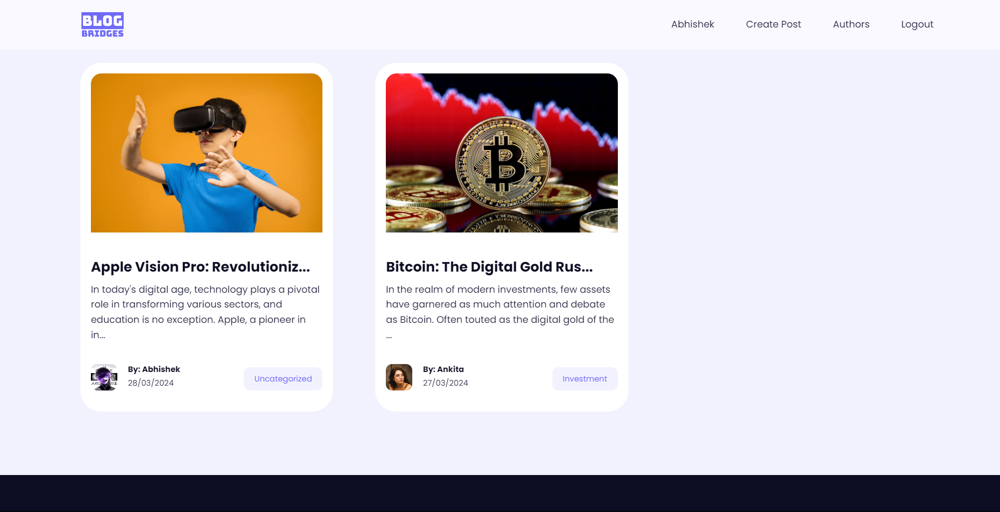

# BLOG-BRIDGE ✨

A full-stack MERN (MongoDB, Express, React, Node.js) blog website with CRUD functionality, user authentication, and more.

## Features

-   **Frontend**
    -   Built with React and utilizes React hooks and custom hooks
    -   Responsive design for mobile and desktop using media queries
    -   React Router for client-side routing
    -   React Quill for rich text editor functionality
-   **Backend**
    -   Node.js with Express for server-side logic
    -   MVC (Model-View-Controller) pattern for structured codebase
    -   JWT (JSON Web Token) for user authentication and authorization
    -   MongoDB with Mongoose for database management
    -   File upload functionality for images and other media

## Technologies Used

-   **Frontend**
    -   React
    -   React Hooks
    -   Custom Hooks
    -   React Router
    -   React Quill
-   **Backend**
    -   Node.js
    -   Express
    -   JWT
    -   MongoDB
    -   Mongoose
-   **Others**
    -   Postman for API testing

## Screenshots:

### Home Page:

### Post Item Page:

### Authors Page:

### Create Post Page:

### User Profile Page:

## Usage

-   Register and login to create, edit, and delete blog posts
-   Use the rich text editor to format your blog posts
-   Upload images and other media files for your blog posts

## Contributing

Pull requests are welcome. For major changes, please open an issue first to discuss what you would like to change.
